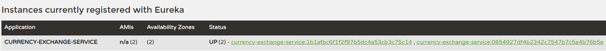
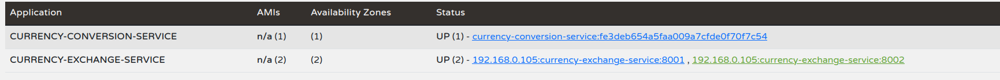
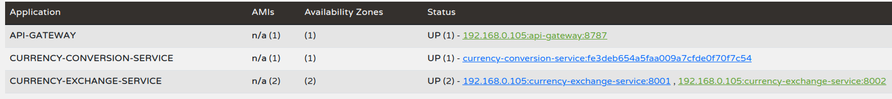
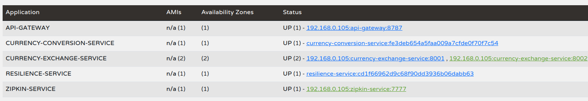
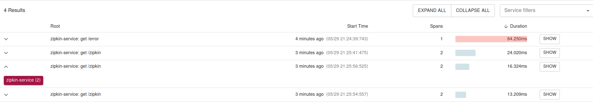

# Spring Boot Medium Microservice example

Spring Boot 2.x example how to create a medium-sized project with microservice architecture

## Description

Spring Boot 2.7.7, Spring Cloud 2021.0.5, REST API, JPA, Eureka server, Api Gateway, Actuator, Resilience4j, Zipkin

### Dependencies

* Java 11
* Gradle
* Build and run with Java 11
* PostgreSQL database
```
sudo update-alternatives --config java (select Java 11) 
```

## Components

### Service Discovery

* Use Netflix Eureka service registry to use client side load balancing and decouples service providers

#### Installing
* Build application
```
gradle clean bootjar
```

#### Running
```
java -jar eureka-naming-server-1.0.0.jar
```

#### Testing
* Check the administrator UI at the following URL
```
http://localhost:8777/
```

### Configuration Service

* Use Spring Cloud service to use profile based externalized configuration

#### Installing
* Create your Git repository and add configuration files
```
mkdir config-repo
cd config-repo
git init
git add "limit-service.properties", "limit-service-dev.properties" and "limit-service-qa.properties" 
git commit -m "Add configuration files"
git push
```
* Edit application.yaml file
```
server:
  port: 8088
spring:
  application:
    name: config-server
  cloud:
    config:
      server:
        git:
          uri: file://YOUR_PATH/config-repo
```
* Build application
```
gradle clean bootjar
```
#### Running
```
java -jar spring-cloud-config-server-1.0.0.jar
```
#### Testing
* Type the following URL to view difference configurations by application profile
```
http://localhost:8088/limit-service/default
http://localhost:8088/limit-service/develop
http://localhost:8088/limit-service/qa
```

### Currency Exchange Service

* Get currency exchange from some currency to another currency

#### Installing
* Create "currency_exchange" database
* Modify the database properties in "application.yaml" file
```
  datasource:
    url: jdbc:postgresql://localhost:5432/currency_exchange
    username: 'your_user'
    password: 'user_password'
```
* Build application
```
gradle clean bootjar
```
#### Running application (in two instances)
```
java -jar -Dserver.port=8001 currency-exchange-service-1.0.0.jar
java -jar -Dserver.port=8002 currency-exchange-service-1.0.0.jar
```

#### Insert rows to "exchange_value" table
```
INSERT INTO public.exchange_value(id, conversion_multiple, currency_from, currency_to) VALUES (1, 1.07, 'EUR', 'USD');
INSERT INTO public.exchange_value(id, conversion_multiple, currency_from, currency_to) VALUES (2, 0.81, 'USD', 'GBP');
```

#### Testing/Check
* You can see two "currency-exchange-service" instance in Eureka admin UI


* You can check the Actuator health endpoints
```
GET http://192.168.0.105:8001/actuator/health
GET http://192.168.0.105:8002/actuator/health
```

* Try currency exchange function
```
GET http://192.168.0.105:8001/currency-exchange/from/EUR/to/USD

response:
{
    "id":1,
    "from":"EUR",
    "to":"USD",
    "conversionMultiple":1.07
}
```

### Currency Conversion Service

* Get currency conversion value, communicate with the "currency-exchange" service

#### Installing
* Build application
```
gradle clean bootjar
```
#### Running application
```
java -jar currency-conversion-service-1.0.0.jar
```
#### Testing/Check
* You can see "currency-conversion-service" instance in Eureka admin UI
  

* You can check the Actuator health endpoints
```
GET http://192.168.0.105:8100/actuator/health
```

* Try currency conversion function
```
GET http://192.168.0.105:8100/currency-converter/from/EUR/to/USD/quantity/3500

response:
{"id":1,"from":"EUR","to":"USD","quantity":3500,"totalCalculatedAmount":3745.00,"port":0,"conversionMultiple":1.07}
```

### API Gateway Server

*  Spring Cloud Gateway aims to provide a simple, yet effective way to route to APIs
   and provide cross cutting concerns to them such as: security, monitoring/metrics, and resiliency.
* This API gateway routing the /check URL to the "currency-exchange" and the "currency-conversion" services


#### Installing
* Build application
```
gradle clean bootjar
```
#### Running application
```
java -jar api-gateway-server-1.0.0.jar
```
#### Testing/Check
* You can see "api-gateway" instance in Eureka admin UI
  

* You can check the Actuator health endpoints
```
GET http://192.168.0.105:8787/actuator/health
```

* Try API Gateway routing function to currency-conversion service
```
GET http://192.168.0.105:8787/currency-conversion-service/check

response:
I am a currency-converter service: 8100
```
* Try API Gateway routing function to currency-exchange service
```
GET http://192.168.0.105:8787/currency-exchange-service/check

response:
I am a currency-exchange service
```

### Resilience Demo Service

* This service calls the "currency-conversion-service/check" URL through the API Gateway use the Circuit Breaker pattern. 

#### Installing
* Build application
```
gradle clean bootjar
```
#### Running application
```
java -jar resilience-demo-1.0.0.jar
```
#### Testing/Check

* You can check the Actuator health endpoints
```
GET http://192.168.0.105:9797/actuator/health
```

* Try resilience demo service
```
GET http://192.168.0.105:9797/currency

response:
Resilience: I am a currency-converter service: 8100
```

### Zipkin Service

* Zipkin is an open-source project that provides mechanisms for sending, receiving, storing, and visualizing traces.
* This allows us to correlate activity between servers and get a much clearer picture of exactly what is happening in our services.

#### Installing

* Install Zipkin Server
```
curl -sSL https://zipkin.io/quickstart.sh | bash -s
java -jar zipkin.jar
```
* 
* Build application
```
gradle clean bootjar
```

#### Running application
```
java -jar zipkin-service-1.0.0.jar
```

#### Testing/Check


* You can check the Actuator health endpoints
```
GET http://192.168.0.105:7777/actuator/health
```

* Try Zipkin service which call "currency-conversion-service" via /zipkin REST URL
```
GET http://192.168.0.105:7777/zipkin

response:
<200,I am a currency-converter service: 8100,[Content-Type:"text/plain;charset=UTF-8", Content-Length:"39", Date:"Mon, 29 May 2023 19:25:56 GMT"]>
```

* You can check Zipkin Server UI to show the trace information



## Author

Kenyeres Géza
https://hu.linkedin.com/in/g%C3%A9za-kenyeres-17341631
